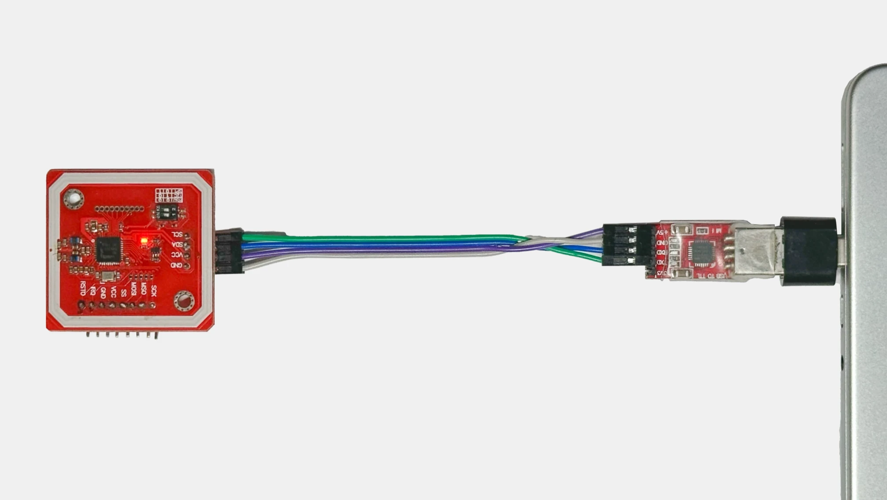

# MQTTHomeKeyLock
A NFC Reader that Exposes a Homekit HomeKey Lock and publishes over mqtt

Still under development

# Configuration

Configuration is done via a Docker Environment Variables, with the following configurables:

<table>
    <thead>
        <tr>
            <th>Category</th>
            <th>Veriable Name</th>
            <th>Description</th>
            <th>Default</th>
        </tr>
    </thead>
    <tbody>
        <tr>
            <td>Docker</td>
            <td>TZ</td>
            <td>The Container Timezone</td>
            <td>"Europe/London"</td>
        </tr>
        <tr>
            <td>Logging</td>
            <td>LOG_LEVEL</td>
            <td>Level to log messages at. All logs related to this codebase use INFO level (20).</td>
            <td>"20"</td>
        </tr>
        <tr>
            <td rowspan=3>NFC</td>
            <td>NFC_PORT</td>
            <td>Path to serial port of the connected NFC module</td>
            <td>"USB0"</td>
        </tr>
        <tr>
            <td>NFC_DRIVER</td>
            <td>Nfcpy driver to use with your device. Implementation was only tested for PN532, other modules have to be verified separately (if supported by nfcpy);</td>
            <td>"pn532"</td>
        </tr>
        <tr>
            <td>NFC_BROADCAST</td>
            <td>Configures if to use broadcast frames and ECP. If this parameter is true but used NFC device is not based on PN532, will cause an exception to be raised, set to false only if such problems occur</td>
            <td>"True"</td>
        </tr>
        <tr>
            <td rowspan=2>HAP</td>
            <td>HAP_PORT</td>
            <td>Network port of the virtual accessory</td>
            <td>"51926"</td>
        </tr>
        <tr>
            <td>HAP_PERSIST</td>
            <td>File to store HAP-python pairing data in</td>
            <td>"/persist/hap.state"</td>
        </tr>
        <tr>
            <td rowspan=4>HomeKey</td>
            <td>HOMEKEY_PERSIST</td>
            <td>File to save endpoint and issuer configuration data in</td>
            <td>"/persist/homekey.json"</td>
        </tr>
        <tr>
            <td>HOMEKEY_EXPRESS</td>
            <td>Configures if to trigger express mode on devices that have it enabled. If set to `false`, bringing a device to the reader will display the key on the screen while asking for biometric authentication. Beware that this doesn't increase security as express mode is disabled on ECP level, so a would-be attacker could always 'excite' the device with express ECP frame and bring it to the reader</td>
            <td>"True"</td>
        </tr>
        <tr>
            <td>HOMEKEY_FINISH</td>
            <td>Color of the home key art to display on your device. Usually, finish of the first NFC lock added to your home defines which color the keys are going to be, even if more locks are added;   Possible values: `black` `tan` `gold` `silver`</td>
            <td>"black"</td>
        </tr>
        <tr>
            <td>HOMEKEY_FLOW</td>
            <td>Minimum viable digital key transaction flow do. By default, reader attempts to do as least actions as possible, with fallback to next level of authentication only happening if the previous one failed. Setting this setting to `standard` or `attestation` will force protocol to fall back to those flows even if they're not required for successful auth. Possible values: `fast` `standard` `attestation`</td>
            <td>"fast"</td>
        </tr>
        <tr>
            <td>Lock</td>
            <td>LOCK_SHOULD_RELOCK</td>
            <td>If the virtual lock should automatically lock after unlocking</td>
            <td>"True"</td>
        </tr>
        <tr>
            <td rowspan=10>MQTT</td>
            <td>MQTT_SERVER</td>
            <td>The MQTT Server to post updates to</td>
            <td>"192.168.1.2"</td>
        </tr>
        <tr>
            <td>MQTT_PORT</td>
            <td>The port on which to connect to the MQTT server</td>
            <td>"1883"</td>
        </tr>
        <tr>
            <td>MQTT_CLIENT_ID</td>
            <td>The client ID to use in MQTT</td>
            <td>"mqtt-homekey-lock"</td>
        </tr>
        <tr>
            <td>MQTT_AUTH</td>
            <td>If it should use MQTT Authentication</td>
            <td>"False"</td>
        </tr>
        <tr>
            <td>MQTT_USER</td>
            <td>The user that should be used when connecting to MQTT</td>
            <td>""</td>
        </tr>
        <tr>
            <td>MQTT_PASS</td>
            <td>The password that should be used when connecting to MQTT</td>
            <td>""</td>
        </tr>
        <tr>
            <td>MQTT_LOCK_ID</td>
            <td>A lock ID to be used to identify the lock in MQTT</td>
            <td>"0"</td>
        </tr>
        <tr>
            <td>MQTT_PREFIX_TOPIC</td>
            <td>The prefix topic to use when posting to MQTT</td>
            <td>"mqtt-homekey-lock"</td>
        </tr>
        <tr>
            <td>MQTT_HASS_ENABLED</td>
            <td>If it should post Home Assistant auto configuration settings in MQTT</td>
            <td>"True"</td>
        </tr>
        <tr>
            <td>MQTT_STATUS_TOPIC</td>
            <td>The status topic to watch for home assistant status</td>
            <td>"homeassistant/status"</td>
        </tr>
        <tr>
            <td rowspan=2>Prometheus</td>
            <td>PROMETHEUS_ENABLED</td>
            <td>Should prometheus metrics be exported.</td>
            <td>"True"</td>
        </tr>
        <tr>
            <td>PROMETHEUS_PORT</td>
            <td>The port prometheus metrics should be exported on.</td>
            <td>"8000"</td>
        </tr>
    </tbody>
</table>

# Requirements

Running this project requires the following:
* An operating system: Linux or macOS;
* Docker instilation;
* A PN532 module connected to a PC or SBC via UART (not through I2C or SPI);
* Either Ethernet or Wi-Fi to ensure HAP can be discovered.

When using a PC, connect the PN532 to a UART adapter, and then connect the adapter to the PC as follows:

  

# Notes

- This code is provided as-is. Considering the sensitive nature of authentication and security, I assume no responsibility for any issues that may arise while using this project;  
- Information is provided here for learning and DIY purposes only, usage in commercial applications is highly discouraged.
- Refrain from posting raw logs as they may contain sensitive information, such as reader private key, issuer id's, etc.
- If you find a bug, feel free to raise an issue;

# Credits

This project would have been impossible without the contributions of:
* [@kupa22](https://github.com/kupa22) - for full HAP part analysis, NFC protocol research;
* [@kormax](https://github.com/kormax) - Proof of Concept, ECP, NFC protocol research;  

Special thanks to:
* [@gm3197](https://github.com/gm3197) - for finding clues about ISO18013 being used in Home Key protocol;
* [@KhaosT](https://github.com/KhaosT/HAP-NodeJS/commit/80cdb1535f5bee874cc06657ef283ee91f258815) - for creating a demo that caused Home Key to appear in Wallet, which partially inspired me/others to go on this journey;
* @ikalchev and @bdraco for developing HAP-Python and helping with accepting in changes that were needed for this project;
* Other people, who gave their input on demo app improvement.

# References

* Learning material:
    - [Apple Home Key - kupa22](https://github.com/kupa22/apple-homekey) - HAP part, deriviation info;
    - [Apple Home Key - kormax](https://github.com/kormax/apple-home-key) - extra Home Key info;
    - [Enhanced Contactless Polling](https://github.com/kormax/apple-enhanced-contactless-polling) - Broadcast Frames, ECP.